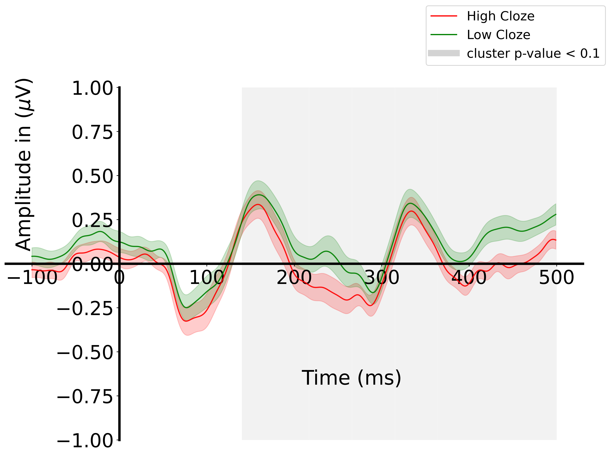
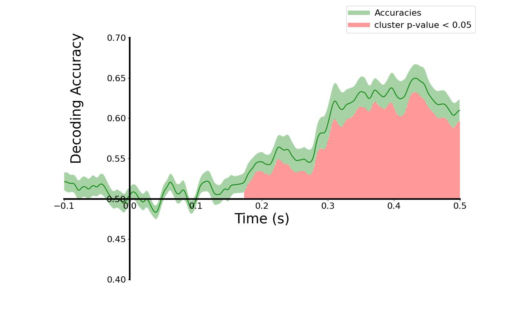
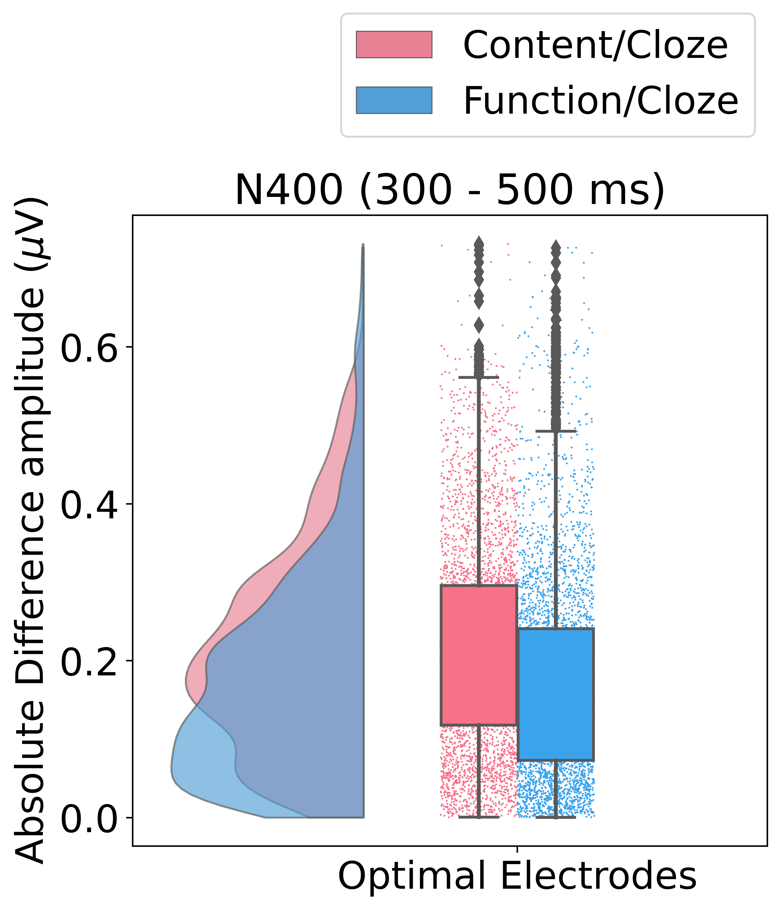
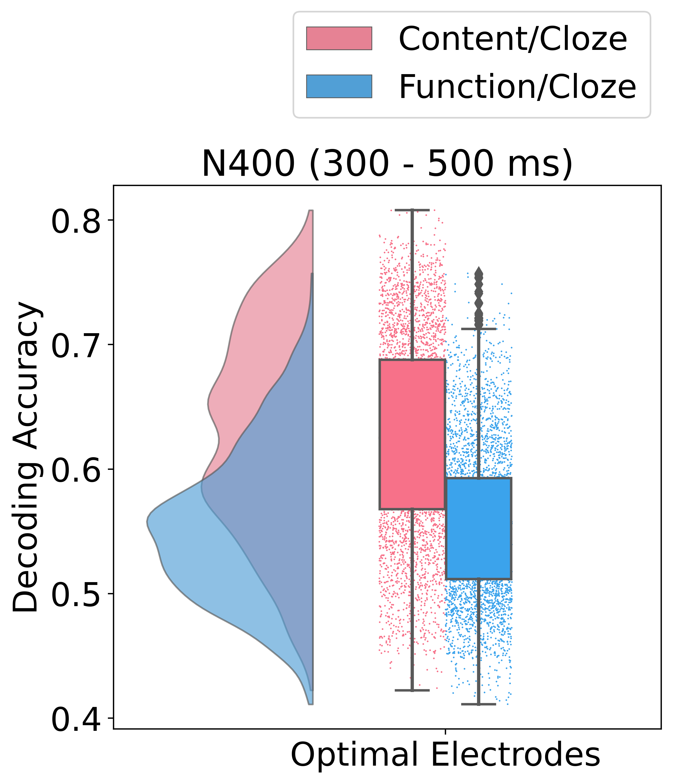

<p align = "center" draggable=”false” >
</p>

# <h1 align="center" id="heading"> Decoding EEG Signals to Explore Next-Word Predictability in the Human Brain</h1>
## 
[![Python][Python.py]][Python-url] 
[![Machine Learning][Machine-Learning.py]][Machine-Learning-url]
[![Decoding Model][Decoding-Model.py]][Decoding-Model-url]
[![Brain Signal][Brain-Signal.py]][Brain-Signal-url]

* Decoding EEG Signals to Explore Next-Word Predictability in the Human Brain.

## Overview
While traditional ERP analyses, such as univariate approaches, have limitations in providing interpretable visualisations, capturing individual variability, and recognising complex patterns, advanced EEG decoding techniques offer enhanced sensitivity, multivariate analysis capabilities, and greater interpretability. This study demonstrates the efficacy of EEG decoding techniques while providing empirical evidences of the neural mechanisms underlying bottom-up (related to high-order linguistic structure) and top-down (related to next-word predictability) processes, which interact to guide comprehension during reading. We examined how predictability, measured by cloze probability, influences brain response differences between content words (nouns, verbs, adjectives, and adverbs) and function words (pronouns, determiners, auxiliaries, and adpositions), particularly focusing on the N400 time window (300-500 ms post-stimulus), known for its sensitivity to semantic incongruities and predictability in reading.


This repository contains the source code for reproducing the paper, along with step-by-step instructions as follows:
* [Environment Setup](#environment-setup)
* [Download Dataset](#download-dataset)
* [Run Data Preparation](#data-preparation)
* [Reproduce Results](#reproduce-results)

## Environment Setup
After cloning repository github, going to the DERCo folder and do the steps as follows

1. Install Python (<a target="_blank" href="https://wiki.python.org/moin/BeginnersGuide">Setup instruction</a>).
   **Note**: In this project, we used Python 3.10.9
2. Install Conda (<a target="_blank" href="https://conda.io/projects/conda/en/latest/user-guide/install/index.html">Conda Installation</a>) or similar environment systems
3. Create a virtual enviroment
```console 
conda create --name [name of env] python==[version]
```
For example,
```console
conda create --name decoding python==3.10.9
```
4. Activate enviroment
```console 
conda activate [name of env]
``` 
5. Install Python packages
```console 
pip3 install -r requirements.txt 
```
## Dowload the project (git)
Clone the project
```consolde
git clone https://github.com/Tayerquach/brain_decoding_model.git
```

Project Organization
------------
    ├── README.md          <- The top-level README for developers using this project.
    ├── data
    │   ├── EEG_data                    <- Contains raw or preprocessed EEG data used for analysis.
    │   ├── article                     <- Stores articles and their corresponding sentence-level data in .npy format.
    │   │   ├── article_0.npy
    │   │   ├── article_1.npy
    │   │   ├── article_2.npy
    │   │   ├── article_3.npy
    │   │   ├── article_4.npy
    │   │   ├── sentences_article_0.npy
    │   │   ├── sentences_article_1.npy
    │   │   ├── sentences_article_2.npy
    │   │   ├── sentences_article_3.npy
    │   │   └── sentences_article_4.npy
    ├── photo  <- contain visualizations, graphs, or images generated or used in the project.
    ├── utils                   <- support preprocessing, analysis, and plotting.
    │   ├── analysis_helpers.py <- Provides helper functions for statistical or computational analysis of EEG data.
    │   ├── config.py           <- Contains configuration settings and constants used across the project, such as paths, hyperparameters, or global variables.
    │   ├── eeg_helpers.py      <- Includes functions for preprocessing and managing EEG data, such as cleaning, filtering, or epoching the data.
    │   ├── plot_helpers.py     <- Contains plotting functions to generate visualizations, such as ERP plots, raincloud plots, or channel maps.
    │   └── techniques.py      <- Contains helper functions for EEG analysis, such as univariate analysis and decoding method.
    ├── requirements.txt        <- The requirements file for reproducing the analysis environment, e.g.
    │                         generated with `pip freeze > requirements.txt`.
    ├── decode_word_class.py    <- Decode word classes from EEG data, potentially distinguishing between different semantic categories like "content" and "function" words.
    ├── extract_optimal_channels.py <- Identify and extract optimal EEG channels for ERP analysis
    ├── run_class_analysis.py      <- Executes class-level analysis on the EEG data, focusing on performance metrics and comparisons between conditions (e.g., high vs. low cloze).
    ├── run_raincloud.py  <- Generates raincloud plots for visualizing data distributions.
    ├── run_cohen_dz.py   <- Calculates and visualises Cohen’s d (effect size) for paired samples from EEG data.
    └── run_preparation.py <- Handles data preparation tasks, such as loading, cleaning, or transforming the EEG and article data into formats suitable for analysis.

--------

## Download Dataset
EEG recordings were obtained from 22 native English speakers as they read The Grimm Brothers' Fairy Tales. Word-by-word cloze probabilities for each word were also gathered using a cloze procedure conducted on the Mechanical Turk crowdsourcing platform. Further information on EEG data collection and preprocessing can be found in the <a target="_blank" href="https://www.nature.com/articles/s41597-024-03915-8">DERCo dataset</a>.

### Approach 1:
To download the DERCo dataset, please
1. Go directly to the <a target="_blank" href="https://osf.io/rkqbu/files/osfstorage">OSF link</a>.
2. The follow the path `OSF Storage / EEG-based Reading Experiment / EEG_data`.
3. After dowloading, move to path: `data/EEG_data/`

### Approach 2:
1. Install `osf` to download EEG data
```console
pip install osfclient
```
2. Fecth the data
```console
osf -p rkqbu clone
```
3. Only keep `EEG_data` folder, and move to path: `data/EEG_data/`

**NOTE**: Remove `.gitkeep` files in `data/EEG_data` and `data/fairy_tales_corpus` after downloading data.

## DATA PREPARATION
### Extract EEG data according word category
For each word type, the code will generate the corresponding EEG data (including 20 subjects), and the labels. 

```console
python run_preparation.py -category=[name-of-type]
```
`name-of-type`: NOUN, VERB, ADJ, ADV, PRON, AUX, DET, ADP, content, function.

For example,
```console
python run_preparation.py -category=function 
```

### Extract optimal electrode cluster (N400 time window)
```console
python extract_optimal_channels.py -category=[word-type]
```
* `word-type`: NOUN, VERB, ADJ, ADV, PRON, AUX, DET, ADP, content, function.

For example,
```console
python extract_optimal_channels.py -category=content
```

**Output**
| Group | Optimal Electrode Cluster |
| :-------- | :------------------------------------------------------------------------------------------------ |
|  **Content**  | P3, P7, CP1, CP2, Pz, P4, Fp2, F7, F3, Fz, F4|
|  **Function**  | FT10, FC1, FC2, C3, Cz, C4, Fp2, F7, F3, Fz, F4|
|  **Noun**  | P3, P7, CP1, CP2, Pz, P4, F7, F3, Fz, F4|
|  **Verb**  | T8, CP6, FT9, P3, P7, CP1, CP2, Pz, P4, F7, F3, Fz, F4|

## Reproduce Results
**Note:** Looking at the folder `photo` to get all results.

***Parameters:***
* `word-type`: content, function, NOUN, VERB, ADJ, ADV, PRON, AUX, ADP, DET.
* `region`: all or best (default is best).
* `permutation`: Conduct cluster-based permutation test or not (True or False).
* `p_value`: The threshold of p-values (e.g., 0.05, 0.001 ...).
* `clusterp`: The threshold of cluster-defining p-values (e.g., 0.05, 0.001 ...).
* `n_iter`: The times for iteration (e.g., 1000, 5000, 10000 ...).

### Univariate ERP analysis
```console
python run_class_analysis.py -category=[word-type] -region=[region-name] -permutation=[True or False] -p_value=[p_value] -clusterp=[clusterp] -n_iter=[number-of-iteration]
```

For example,

```console
python run_class_analysis.py -category=content -region=best -permutation=True -p_value=0.05 -clusterp=0.05 -n_iter=5000
```

**Output**
<p align = "center" draggable=”false” >
</p>

### Decoding EEG signals
```console
python decode_word_class.py -category=[word-type] -region=[name-region] -permutation=[True or False] -p_value=[p_value] -clusterp=[clusterp] -n_iter=[number-of-iteration]
```

For example,

```console
python decode_word_class.py -category=content -region=best -permutation=True -p_value=0.05 -clusterp=0.05 -n_iter=5000
```
**Output**
<p align = "center" draggable=”false” >
</p>

### Rain Cloud Visualisation
1. Raincloud plots displaying the absolute difference in a specific time window (e.g., N400 amplitude).

2. Raincloud plots showing decoding accuracy for distinguishing between high and low cloze conditions during a specific time window (e.g., N400 time window).

```console
python run_raincloud.py -category=[group] -technique=[name-technique] -start_window=[start] -end_window=[end]  
```
* `group`: lexical_class (content vs. function words), content_group (NOUN vs. VERB), function_group (DET vs. PRON)
* `name-technique`: univariate, decoding

For example,

```console
python run_raincloud.py -category=lexical_class -technique=univariate -start_window=300 -end_window=500  
```
**Output**
<p align = "center" draggable=”false” >
</p>

For example,

```console
python run_raincloud.py -category=lexical_class -technique=decoding -start_window=300 -end_window=500  
```

**Output**
<p align = "center" draggable=”false” >
</p>

### Cohen's dz Analysis

```console
python run_cohen_dz.py -category=[word-type] -optimal=[True or False] -start_window=[start] -end_window=[end] 
```

For example,
```console
python run_cohen_dz.py -category=NOUN -optimal=False -start_window=300 -end_window=500 
```

**Output**
<p align = "center" draggable=”false” >
</p>

<!-- Note that the `optimal` parameter will decide whether the optimal electrodes for ERP analysis will be averaged or not. If not, the data will be averaged across all electrodes.

For example,
```console
python run_cohen_dz.py -category=NOUN -optimal=True -start_window=300 -end_window=500 
```

**Output**
<p align = "center" draggable=”false” >
</p> -->

## Contact 
- Boi Mai Quach (Dublin City University, quachmaiboi@gmail.com) 
- Link to the paper:

## Citation
```bibtex
Accept to the 46th Annual Conference of The Cognitive Science Society 2025 (CogSci)
Citation will be updated upon proceedings publication.
```


<!-- MARKDOWN LINKS & IMAGES -->
[Python.py]: https://img.shields.io/badge/python-3670A0?style=for-the-badge&logo=python&logoColor=ffdd54
[Python-url]: https://www.python.org/

[Decoding-Model.py]: https://img.shields.io/badge/decoding%20model-00A86B?style=for-the-badge&logo=data:image/svg+xml;base64,<your_svg_data_here>
[Decoding-Model-url]: https://example.com/decoding-model

[Brain-Signal.py]: https://img.shields.io/badge/brain%20signal-FF6347?style=for-the-badge&logo=data:image/svg+xml;base64,<your_svg_data_here>
[Brain-Signal-url]: https://example.com/brain-signal

[Machine-Learning.py]: https://img.shields.io/badge/Machine%20Learning-4682B4?style=for-the-badge&logo=scikit-learn&logoColor=FFFFFF
[Machine-Learning-url]: https://scikit-learn.org/
